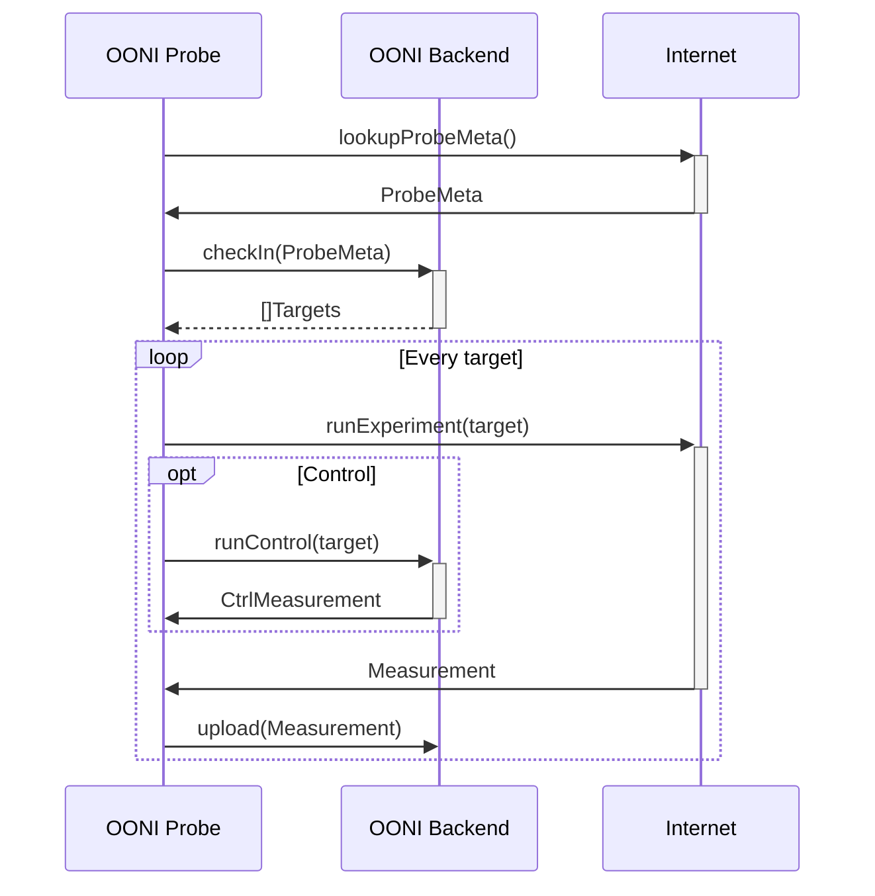
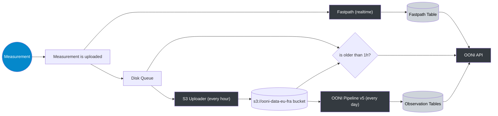

# OONI Backend

**NOTE** this repository contains both the monolith API backend code (inside of `api/`) and the new port to some updated patterns based on fastapi (see: `ooniapi/`) 

The backend infrastructure performs multiple functions:

- Provide APIs for data consumers

- Instruct probes on what measurements to perform

- Receive measurements from probes, process them and store them in the database

- Upload new measurements to a bucket on [S3 data bucket](#s3-data-bucket)

- Fetch data from external sources e.g. fingerprints from a GitHub repository

## Main data flows

OONI Probes will run generally once every hour or every day, depending on the platform.
As part of these runs the sequence diagram of a probe run looks like the following:

The following diagram on the other hand, represents the main flow of measurement data.

The dark rectangles represent processes. The cilinders represent data at rest:
as files on disk, files on S3 or records in database tables.

Probes submit measurements to the API with a POST at the following path:
<https://api.ooni.io/apidocs/#/default/post_report__report_id_> The
measurement is optionally decompressed if zstd compression is detected.
It is then parsed and added with a unique ID and saved to disk. Very
little validation is done at this time in order to ensure that all
incoming measurements are accepted.

Measurements are enqueued on disk using one file per measurement. On
hourly intervals they are batched together, compressed and uploaded to
S3 by the [Measurement uploader](#measurement-uploader)&thinsp;⚙. The batching is
performed to allow efficient compression. See the
[dedicated subchapter](#measurement-uploader)&thinsp;⚙ for details.

The measurement is also sent to the [Fastpath](#fastpath)&thinsp;⚙. The
Fastpath runs as a dedicated daemon with a pool of workers. It
calculates scoring for the measurement and writes a record in the
fastpath table. Each measurement is processed individually in real time.
See the [dedicated subchapter](#fastpath)&thinsp;⚙ below.

The disk queue is also used by the API to access recent measurements
that have not been uploaded to S3 yet. See the
[measurement API](#getting-measurement-bodies)&thinsp;🐝 for details.

## Reproducibility

The measurement processing pipeline is meant to generate outputs that
can be equally generated by 3rd parties like external researchers and
other organizations.

This is meant to keep OONI accountable and as a proof that we do not
arbitrarily delete or alter measurements and that we score them as
accessible/anomaly/confirmed/failure in a predictable and transparent
way.

> **important**
> The only exceptions were due to privacy breaches that required removal
> of the affected measurements from the [S3 data bucket](#s3-data-bucket)&thinsp;💡
> bucket.

As such, the backend infrastructure is
[FOSS](https://en.wikipedia.org/wiki/Free_and_open-source_software) and
can be deployed by 3rd parties. We encourage researchers to replicate
our findings.

Incoming measurements are minimally altered by the
[Measurement uploader](#measurement-uploader)&thinsp;⚙ and uploaded to S3.
