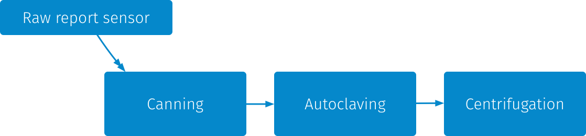
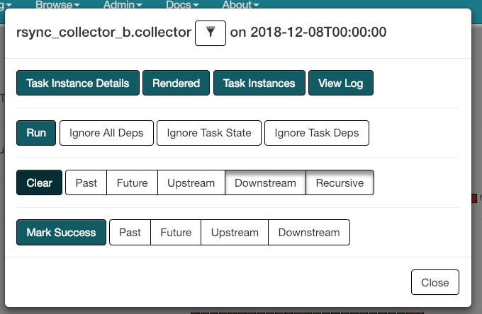

# OONI pipeline

version: 3.0.0

> If OONI were a car, the OONI Pipeline would be it's engine

Pipeline is responsible for aggregating data from network measurement clients
(such as OONI Probe) and analyze it to identify network anomalies.

The main goals are:

* Have a reasonable end-to-end latency (the delta from when a measurement is
 uploaded to when it appears in api.ooni.io). Our target is minutes/hours,
 not seconds.

* Make it easy to re-run new heuristics on top of the existing dataset

* Ease parallelization of CPU intensive tasks to use all available cores on a
 single machine

## Architecture



The OONI Pipeline is currently based on primarily 3 stages, that are run on
every "tick": 1. *Canning*, 2. *Autoclaving*, 3. *Centrifugation*.

### Canning

The purpose of the **canning** stage is to convert report files, which are collections of
measurements, into a more compact representation that makes the files occupy
less space on disk, but also allows us to reprocess the measurements faster.

When we intend to re-run the heuristics against historical data, this stage is
going to be skipped most of the times.

This is done in the following way:

```
canning-1.py | tar c 2000-13-42/foo.yaml 2000-13-42/bar.json
  | canning-2.py | lz4 -5
  | canning-3.py
```

`canning-1.py`: groups reports by `test_name`, slices them into ~64 Mbytes groups of
uncompressed data and send them to `tar`.

`canning-2.py`: reads a `.tar` file, verifies the sizes of reports, calculates
the sha1 and crc32 of each report, calculate size of tar file and then pipes
the unmodified tar file to `lz4`.

`canning-3.py`: reads a `.lz4` from the pipe, calculates it's size, sha1 and
crc32, dumps the lz4 file & all the checksums to disk.

Note: the script names are not the names of the actual script files, but are
just used for example purposes.

All the sizes are recorded to be checked to avoid various sort of unexpected
file truncations.

### Autoclaving

The purpose of the **autoclaving** stage is to perform normalization and
sanitization of the report files including
[PII cleanup](https://github.com/TheTorProject/ooni-pipeline/issues/105)
if leak is discovered.
This means converting legacy YAML reports to JSON as well as converting all
measurements to a consistent JSON format (and performing some fixes to the data
format to avoid surprising consumers of the data).

In other words, it converts tar.lz4 files in a 1:1 way.
lz4 compression is a bit tricky at this stage: lz4 frames are independent,
report offsets within the block are recorded in the separate index file, so the
resulting file is both streamable (with ability to skip tar records without
decoding), seekable (single lz4 frame is read to get a single report — that's
~56kb of compressed data) and readable with ordinary `tar -I lz4 --extract` for
whoever wants to parse sanitized measurements.

Indexes for the reports are stored as well, they include block offsets, sizes,
and offsets within block required to seek() to exact measurement and to read the
file in streaming way without parsing tarfile stream.

### Centrifugation

**Centrifugation** is where the interesting things start happening. It's what is
done to "enrich" the data.
It reads data sanitized by autoclaving, extracts the essence that can be aggregated and
stores metadata into a PostgreSQL database for further processing.

Note: in the airflow DAG view this is actually called `meta_pg`.

### Raw reports sensor

This is not technically a task, but is rather a "sensor" in airflow lingo. What
this means is that a check is done at `chameleon` (the host that aggregates all
measurements from OONI collectors) to see if there is more work to do and if so
will start a new iteration of the DAG.

## Stack

The technological stack of the pipeline is the following:

* [Airflow](https://airflow.incubator.apache.org/) as a workflow manager or put
 otherwise a "enhanced cron"
* [PostgreSQL](https://www.postgresql.org/) as the primary database used to
 store metadata
* [Docker](https://www.docker.com/) to create containers for the various stages
 of the pipeline, without having to worry about dependency management
* [Ansible](https://www.ansible.com/) to make deployment automation easier


## Usage

In this section we will go over some of the common tasks related to operating
and contributing to the OONI Pipeline.

It's important to keep in mind that every task inside of the Airflow DAG needs
to be optimized for big units of computation, you should avoid having small
tasks, otherwise you incur in a lot of scheduling/orchestration overhead.

### Modifying the centrifugation stage

Most of the time you will probably care to edit the **centrifugation** stage
instead of adding a new DAG task, to avoid re-reading the measurements multiple
times.

1. Edit the centrifugation file

The file to edit is located in `af/shovel/centrifugation.py`.

Most of the time you will be adding a new `Feeder`. A `Feeder` is something
that populates a given table with a particular class of measurements.

To create a new `Feeder` you will have to implement some methods:

```python
class MyFeeder(BaseFeeder):
    min_compat_code_ver = 4
    data_table = sink_table = 'my_fancy_test'
    columns = ('msm_no', 'some_value')

    @staticmethod
    def row(msm_no, datum):
        ret = ''
        if datum['test_name'] == 'my_fancy_test':
            some_value = datum['test_keys'].get('some_value', None)
            ret = '{:d}\t{}\n'.format(
              msm_no,
              pg_quote(some_value) # if it's nullable or string
            )
        return ret

    @staticmethod
    def pop(datum):
        test_keys = datum['test_keys']
        test_keys.pop('some_value', None)
```

The `row` method should return a row in `COPY FROM` syntax to populate the `sink_table` with the
extracted metadata.

The `pop` method should pop all the extracted keys (or the keys specific to this test that are to be ignored), so that the resulting datum is "clean".

The `sink_table` class attribute defined which table is going to be written and
`columns` specifies which columns should be present in such table.
`data_table` defines the table to cleanup in case of _reprocessing_, that's
useful if `sink_table` is temporary (in that case you'll likely have to
implement `close()` method that melds temporary table into persistent one).

`min_compat_code_ver` defines centrifugration code versions that are
compatible with this extractor. If you are adding a new feeder, then this
should contain the single bumped `CODE_VER` string (more on this
below).

1b. (optional) Create SQL migration script

If you are populating new tables, or the schema of existing tables need to
change, you need to create a new SQL migration script inside of `af/oometa/`.

Be sure to write both the `install` and the `rollback` version of it.

In the `install`, wrap everything inside of a transaction and call the
[versioning helper](https://github.com/depesz/Versioning), for example:

```
BEGIN;

select _v.register_patch( '00x-my-new-schema', ARRAY[ '00x-depends-on' ], NULL );

-- Create your tables or make changes

COMMIT;
```

In the `rollback`, you should restore the DB to previous state and call the
unregister method of `_v`:

```
BEGIN;

select _v.unregister_patch( '00x-my-new-schema' );

-- Drop the table you create or alter the schema to be in the previous state

COMMIT;
```

2. Push a new docker image

You should then build a new docker image by bumping the version number inside of
`af/shovel/build`.

The image should then be pushed to dockerhub by running:

```
docker push openobservatory/shovel:latest && docker push openobservatory/shovel:0.0.NN
```

3. Redeploy an update

To redeploy the updated version of the pipeline you should use
[ooni-sysadmin](https://github.com/thetorproject/ooni-sysadmin).

Bump the version number inside of `ansible/roles/airflow/files/docker-trampoline`,
then run from the `ansible` directory:

```
./play deploy-pipeline.yml --tags airflow-dags
```

4. Reprocess the data

To re-process the data through the Airflow UI and scheduler, do the following:

* Got to Tree view

* Click on the task you want to reprocess

* Click on "Clear" and select "Past"

* Click "Done"

* In the confirmation page click on "OK"

**Warning**: the airflow scheduler is imperfect and has issues handling too
many DAGs being in `running` state wasting lots of CPU. Moreover, [using
`airflow backfill` is also
error-prone](https://github.com/TheTorProject/ooni-sysadmin/pull/181#issuecomment-343583222)
as backfill process 1) does not go through scheduler so it does not respect
Pools; 2) may delay processing of new buckets for some days because it consumes
all worker slots; 3) marks touched DagRuns as backfilled with magic `backfill_`
prefix so these DagRuns become always-skipped by scheduler and `airflow clear`
does not re-trigger them anymore.

In the future we will have a `Makefile` to run backfilling without airflow
scheduling overhead while preserving task logs and states.

## How do add fingerprints to database

Fingerprints are what we use to detect web censorship and we currently only
consider censorship to be "confirmed" when we have a positive ID on the
blockpage fingerprint.

In here we explain how you can go about adding new fingerprints to the DB.

1. Create the SQL migration scripts

You should use a template the migration file
`af/oometa/003-fingerprints.install.sql` and
`af/oometa/003-fingerprints.rollback.sql`.

Based on this create a new set of files in `af/oometa/` called
`00x-fingerprints.install.sql` and `00x-fingerprints.rollback.sql`.

2. Run the migration script on the DB

You should then manually apply the schema by running the `install` sql script on
the database directly.

3. Bump version information in `centrifugation.py`

Look inside of `centrifugation.py` and bump `CODE_VER`.
In the same file change `min_compat_code_ver` in `HttpRequestFPFeeder`.

4. Fix assertion to the fingerprint table

At some point inside of `centrifugation.py` there is a line that says something like:

```
assert '916446978a4a86741d0236d19ce7157e' == next(c)[0], 'fingerprint table does not match CODE_VER
```

You should change the hash value to the output of the following query on the DB:

```
select md5(
    md5(array_agg(fingerprint_no    order by fingerprint_no)::text) ||
    md5(array_agg(origin_cc         order by fingerprint_no)::text) ||
    md5(array_agg(body_substr       order by fingerprint_no)::text) ||
    md5(array_agg(header            order by fingerprint_no)::text) ||
    md5(array_agg(header_prefix     order by fingerprint_no)::text) ||
    md5(array_agg(header_value      order by fingerprint_no)::text) ||
    ''
) from fingerprint
```

5. Deploy and re-process the data

Basically you need to do the same thing you did in "Modifying the centrifugation
stage" from step 2. onwards.

The task you want to re-run is labelled `meta_pg`.

Reprocessing the whole dataset takes a couple of days, it's done
asynchronously, but the pipeline does not implement any priorities, so it may
block data ingestion for a while.

### Extending or adding a new DAG

Some examples of tasks that require one or the other:

* extend: fetch data from collectors or backup stuff to S3 after processing
* new dag: fetch data regarding ASNs (as there is no dependency on other tasks)

Also, DAGs may trigger another DAGs, but DAGs are "pausable" so it's another
way to reason about extending vs. creation. E.g. one may want to be able to
pause processing, but continue ingestion.

You need to edit the DAG inside of ooni-sysadmin repo:
https://github.com/TheTorProject/ooni-sysadmin/tree/master/ansible/roles/airflow/files/airflow-dags

Add a `BashOperator`, get the `task_id`.

Then add a new switch case inside of
`ansible/roles/airflow/files/docker-trampoline`.

### Partial re-processing

There are following usual reasons to run partial re-processing:

- PII leaks are identified and corresponding public autoclaved files have to be
  updated (as well as LZ4 framing in these files), so these files must be
  re-processed from scratch
- processing schema changes for some "low-volume" test method like
  `vanilla_tor` (~99% of data volume is `web_connectivity` test data)
- new files are added to the bucket when pipeline ticks more often than daily

PII leak may be handled with `UPDATE autoclaved SET code_ver = 0 WHERE …`, `0`
is _reserved_ `code_ver` value also named `CODE_VER_REPROCESS`.
`centrifugation.py` will re-ingest alike autoclaved file while preserving `msm_no`.

### Investigating DAG failures

It's mostly useful to look at the "Tree view" (ex. http://127.0.0.1:8080/admin/airflow/tree?num_runs=25&dag_id=fetcher) for the DAG, rather than the "Dag
Runs". The `failure` state can be relative to a full DAG or to a Task.

When in the "Tree View" you can click on a single task and "View Log" to
inspect the log that will likely contain the reason for the failure.

Once you have made the necessary fixes that you believe should fix the DAG
(generally this will involve running the `ooni/sysadmin` playbook
`deploy-pipeline`), you should "Clear" the state of the task to have it re-run.




## OONI Infrastructure specific

To access airflow web-interface you need to setup a SSH tunnel. It runs at
`datacollector.infra.ooni.io`.

This line is what you want inside of your config:
```
Host datacollector.infra.ooni.io
LocalForward localhost:8080 172.26.43.254:8080
```

## Learn more

More documentation can be found in [docs/pipeline-16.10.md](docs/pipeline-16.10.md)
