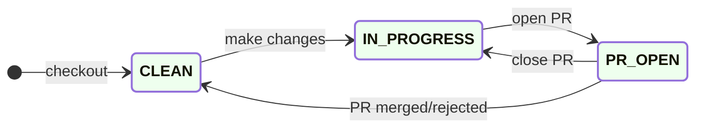

# API

The API provides entry points used by the probes,
[Explorer](#ui:explorer) [Test List Editor](#test-list-editor)&thinsp;🖱 and other UIs, and
researchers.

Entry points under `/api/v1/` are meant for public consumption and
versioned. Those under `/api/_/` are for internal use.

The API is versioned. Access is rate limited based on source IP address
and access tokens. See [Rate limiting and quotas](#rate-limiting-and-quotas)&thinsp;🐝 for
details.

due to the computational cost of running heavy queries on the database.
The API entry points are documented at
[apidocs](https://api.ooni.io/apidocs/) using
[flasgger](https://flasgger.pythonanywhere.com/). A swagger JSON
specification is published at <https://api.ooni.io/apispec_1.json>

The file is also tracked at
<https://github.com/ooni/backend/blob/0ec9fba0eb9c4c440dcb7456f2aab529561104ae/api/docs/apispec.json>
It is checked for consistency by CI in the
[API end-to-end test](#api-end-to-end-test)&thinsp;💡, see
<https://github.com/ooni/backend/blob/0ec9fba0eb9c4c440dcb7456f2aab529561104ae/.github/workflows/test_new_api.yml#L27>

To regenerate the spec file when implementing changes to the API use:
<https://github.com/ooni/backend/blob/0ec9fba0eb9c4c440dcb7456f2aab529561104ae/api/tools/check_apispec_changes>

Before diving into the API codebase it's worth glancing at commonly used
functions:

URL parameter parsing utilities at
<https://github.com/ooni/backend/blob/0ec9fba0eb9c4c440dcb7456f2aab529561104ae/api/ooniapi/urlparams.py>

Caching functions `cachedjson` and `nocachejson` at
<https://github.com/ooni/backend/blob/0ec9fba0eb9c4c440dcb7456f2aab529561104ae/api/ooniapi/utils.py#L18>

Various database access functions `query_click`, `insert_click` at
<https://github.com/ooni/backend/blob/0ec9fba0eb9c4c440dcb7456f2aab529561104ae/api/ooniapi/database.py#L73>

API routes are mounted at:
<https://github.com/ooni/backend/blob/0ec9fba0eb9c4c440dcb7456f2aab529561104ae/api/ooniapi/database.py#L73>

Functions related to initialization of the service and configurating
rate limiting:
<https://github.com/ooni/backend/blob/0ec9fba0eb9c4c440dcb7456f2aab529561104ae/api/ooniapi/app.py>

> **note**
> Caching can be a source of bugs: enabling or disabling it explicitly in
> the codebase (instead of relying on defaults in Nginx/HaProxy) improves
> readability.

> **important**
> Various queries are designed to support active/standby or active/active
> database setups. See [Overall design](#overall-design)&thinsp;💡 for details.

## API cache

The API uses cacheing functions provided by [Nginx](#nginx)&thinsp;⚙.

Caching functions `cachedjson` and `nocachejson` are defined at
<https://github.com/ooni/backend/blob/0ec9fba0eb9c4c440dcb7456f2aab529561104ae/api/ooniapi/utils.py#L18>

## ASN

Autonomous System Number, described at
<https://en.wikipedia.org/wiki/Autonomous_system_(Internet>) It is
stored as `probe_asn` in measurements, and as `probe_asn` column in the
[fastpath table](#fastpath-table)&thinsp;⛁. Used as a search term in
[Searching for measurements](#api:list_msmts) and [Aggregation and MAT](#aggregation-and-mat)&thinsp;🐝

The lookup system in the API is updated by the
[ASN metadata updater](#asn-metadata-updater)&thinsp;⚙. See
[ASN metadata updater dashboard](#asn-metadata-updater-dashboard)&thinsp;📊 and [ooni-update-asn-metadata
timer](#timer:asnmeta_updater).

## Geolocation

The API and implements
[geolocation](https://en.wikipedia.org/wiki/Internet_geolocation) in
order to identify the [ASN](#asn)&thinsp;💡

## Auth

This module implements browser authentication and user accounts. See
[Probe services](#probe-services)&thinsp;🐝 for probe authentication.

It is designed to fit the following requirements:

- Never store users email address centrally nor IP addresses nor
  passwords

- Verify email to limit spambots. Do not use CAPCHAs or other 3rd
  party services

- Support multiple sessions and multiple devices, ability to register
  multiple times

- Do not leak the existence of absence of accounts for a given email
  address

Workflow:

- To register the UIs call
  <https://api.ooni.io/apidocs/#/default/post_api_v1_user_register>
  using an email address and the user receives a temporary login link
  by email

- Upon clicking on the link the UIs call
  <https://api.ooni.io/apidocs/#/default/get_api_v1_user_login> and
  receive a long-lived JWT in a cookie

- The UIs call any API entry point sending the JWT cookie

- The UIs call
  <https://api.ooni.io/apidocs/#/default/get_api_v1_user_refresh_token>
  as needed to refresh the JWT

The API als provides entry points to:

- Get account metadata
  <https://api.ooni.io/apidocs/#/default/get_api___account_metadata>

- Get role for an existing account
  <https://api.ooni.io/apidocs/#/default/get_api_v1_get_account_role__email_address_>

- Set account roles
  <https://api.ooni.io/apidocs/#/default/post_api_v1_set_account_role>

Browsers sessions can be expunged to require users to log in again. This
can be used if an account role needs to be downgraded or terminated
urgently.

> **important**
> Account IDs are not the same across test and production instances.

This is due to the use of a configuration variable
`ACCOUNT_ID_HASHING_KEY` in the hashing of the email address. The
parameter is read from the API configuration file. The values are
different across deployment stages as a security feature.

Also see [Creating admin API accounts](#creating-admin-api-accounts)&thinsp;📒 for more
details.

[Sources](https://github.com/ooni/backend/blob/0ec9fba0eb9c4c440dcb7456f2aab529561104ae/api/ooniapi/auth.py)

## Measurements

This module primarily provides entry points to access measurements,
typically used by Explorer and sometimes directly by users.

Mounted under `/api/v1/measurement/`

[Sources](https://github.com/ooni/backend/blob/0ec9fba0eb9c4c440dcb7456f2aab529561104ae/api/ooniapi/measurements.py)

### Searching for measurements

The entry point
<https://api.ooni.io/apidocs/#/default/get_api_v1_measurements> provides
measurement searching and listing.

It is primarily used by <https://explorer.ooni.org/search>

### Getting measurement bodies

Various API entry points allow accessing measurement bodies. Typically
the lookup is done by `measurement_uid`:

- <https://api.ooni.io/apidocs/#/default/get_api_v1_measurement__measurement_uid_>

- <https://api.ooni.io/apidocs/#/default/get_api_v1_raw_measurement>

- <https://api.ooni.io/apidocs/#/default/get_api_v1_measurement_meta>

For legacy reasons measurements can also be accessed by `report_id` +
`input` instead of `measurement_uid`

> **important**
> Accessing measurements by `report_id` + `input` does not guarantee
> uniqueness.

The lookup process can access measurement bodies from multiple
locations. The lookup is performed in different order for different
measurements based on the likelihood of success:

- Scan the local spool directory
  `/var/lib/ooniapi/measurements/incoming/` for fresh measurements

- Scan other API hosts (if any) for fresh measurements. This is
  required to support active/active backend deployments.

- Lookup the measurement data in [jsonl table](#jsonl-table)&thinsp;⛁ and then
  fetch the required [JSONL files](#jsonl-files)&thinsp;💡 from
  [S3 data bucket](#s3-data-bucket)&thinsp;💡 and extract the content.

#### Performance considerations

Fetching data from the [S3 data bucket](#s3-data-bucket)&thinsp;💡 bucket can be resource-intensive. However:

- Very recent measurements are likely to be found in the local on-disk
  queue instead of having to fetch them from S3. See
  [Measurement uploader](#measurement-uploader)&thinsp;⚙ for details.

- Frequently accessed measurements benefit from the [API cache](#api-cache)&thinsp;💡.

- Measurement bodies are rarely accessed. The overall amount of
  measurements is too large for users to explore a significant
  fraction through the web UIs.

Possible improvements are:

- Compress JSONL files using <https://github.com/facebook/zstd> with
  high compression rates

- Use a seekable format and store the measurement location in the
  JSONL file in the [jsonl table](#jsonl-table)&thinsp;⛁ expressed in bytes. See
  <https://github.com/facebook/zstd/blob/dev/contrib/seekable_format/README.md>

<https://github.com/ooni/backend/blob/0ec9fba0eb9c4c440dcb7456f2aab529561104ae/api/ooniapi/measurements.py>

### Measurement feedback

This part of the API is used to collect and serve user feedback on
measurements. It uses [msmt_feedback table](#msmt_feedback-table)&thinsp;⛁ and
provides:

- Getting feedback for an existing measurement
  <https://api.ooni.io/apidocs/#/default/get_api___measurement_feedback__measurement_uid_>

- Submitting new feedback
  <https://api.ooni.io/apidocs/#/default/post_api___measurement_feedback>

All users can access feedbacks but only authenticated ones can submit
their feedbacks.

Users can submit only one feedback for each measurement. When the
submission entry point is called a second time for the same measurements
the previous feedback is overwritten using database row deduplication.

Valid feedback statuses are:

    blocked
    blocked.blockpage
    blocked.blockpage.http
    blocked.blockpage.dns
    blocked.blockpage.server_side
    blocked.blockpage.server_side.captcha
    blocked.dns
    blocked.dns.inconsistent
    blocked.dns.nxdomain
    blocked.tcp
    blocked.tls
    ok
    down
    down.unreachable
    down.misconfigured

[Sources](https://github.com/ooni/backend/blob/0ec9fba0eb9c4c440dcb7456f2aab529561104ae/api/ooniapi/measurements.py)

## Aggregation and MAT

The aggregation API leverages the OLAP features of
[ClickHouse](#clickhouse)&thinsp;⚙ to provide summaries and statistics on
measurements. It is primarily used by the
[MAT](https://explorer.ooni.org/chart/mat). It can also be used to
implement other statistics in Explorer or accessed directly by
researchers to extract data.

[Aggregation entry
point](https://api.ooni.io/apidocs/#/default/get_api_v1_aggregation)

[Sources](https://github.com/ooni/backend/blob/0ec9fba0eb9c4c440dcb7456f2aab529561104ae/api/ooniapi/aggregation.py)

> **important**
> Caching of this entry point should be implemented carefully as new
> measurements are constantly being inserted and old measurements might be
> occasionally reprocessed.

Also see [Aggregation cache monitoring](#aggregation-cache-monitoring)&thinsp;🐍 and
[Investigating heavy aggregation queries runbook](#investigating-heavy-aggregation-queries-runbook)&thinsp;📒.

## Probe services

This part of the API is implemented in the `probe_services.py` module.
It provides entry points that are meant to be used exclusively by
probes.

[Sources](https://github.com/ooni/backend/blob/0ec9fba0eb9c4c440dcb7456f2aab529561104ae/api/ooniapi/probe_services.py)

### Check-in

This entry point is the preferred way for probes to:

- Geo-resolve their IP address to [ASN](#asn)&thinsp;💡 and network name.
  See

- Receive a list of URLs for [Web connectivity test](#web-connectivity-test)&thinsp;Ⓣ

- Receive a list of test helpers

- Set flags to implement incremental rollouts and A/B testing new
  features

See <https://api.ooni.io/apidocs/#/default/post_api_v1_check_in>

Test lists are prioritized based on the country code and
[ASN](#asn)&thinsp;💡 of the probes, as well as flags indicating if the
probe is connected to WiFi and the battery is being charged.

## Tor targets

Tor targets are served: at path `/api/v1/test-list/tor-targets`. See
<https://api.ooni.io/apidocs/#/default/get_api_v1_test_list_tor_targets>

They are read from a configuration file. The path is set in the main
configuration file under `TOR_TARGETS_CONFFILE`. It usually is
`/etc/ooni/tor_targets.json`.

To make changes in the Tor targets see the runbook
[Updating tor targets](#updating-tor-targets)&thinsp;📒

## Test helpers list

This entry point provides a list of test helpers to the probes:
<https://api.ooni.io/apidocs/#/default/get_api_v1_test_helpers>

> **important**
> Test helpers addresses are served with a load-balancing algorithm. The
> amount requests per second they receive should be consistent across
> hosts, except for `0.th.ooni.org`.

`0.th.ooni.org` is treated differently from other test helpers:
it receives less traffic to allow testing new releases with lower impact.

See
<https://github.com/ooni/backend/blob/86c6c7e1d297fb8361a162f6081e5e138731e492/api/ooniapi/probe_services.py#L480>

### Miscellaneous probe configuration data

Various endpoints provide data to configure the probe:

- <https://api.ooni.io/apidocs/#/default/get_api_v1_collectors>

- <https://api.ooni.io/apidocs/#/default/get_api_v1_test_list_psiphon_config>

- <https://api.ooni.io/apidocs/#/default/post_bouncer_net_tests>

### Probe registration and login

Two entry points provide probe registration and login. The mechanism and
the accounts are legacy and completely independent from
[Auth](#auth)&thinsp;🐝.

The workflows follow these steps:

- A new probe registers and receives a `client_id` token using
  <https://api.ooni.io/apidocs/#/default/post_api_v1_register>

- The token is stored permanently on the probe

- The probe calls
  <https://api.ooni.io/apidocs/#/default/post_api_v1_login> when
  needed and receives a temporary token

- The probe calls check-in supplying the temporary token

On [backend-fsn.ooni.org](#backend-fsn.ooni.org)&thinsp;🖥 the two entry points are currently
being redirected to a different host implementing
<https://orchestrate.ooni.io/> while other backend hosts are exposing
the endpoints in the API.

> **important**
> The probe authentication implemented in the API is not backward
> compatible with credentials already generated by Orchestrate and stored
> by existing probes.

### Measurement submission

The probe services module also provides entry points to submit
measurements. The submission is done in steps:

1.  The probe opens a new report at
    <https://api.ooni.io/apidocs/#/default/post_report>

2.  The probe submit one or more measurements with one HTTP POST each at
    <https://api.ooni.io/apidocs/#/default/post_report__report_id_>

3.  The probe optionally closes the report using
    <https://api.ooni.io/apidocs/#/default/post_report>*report_id*close
    Closing reports is currently unnecessary.

### Robots.txt

Probe services also serve the `robots.txt` file at
<https://api.ooni.io/robots.txt>
<https://api.ooni.io/apidocs/#/default/get_robots_txt>

This is use to block or throttle search engines and other bots that in
the past caused significant load on the API.

> **note**
> some aggressive bots might ignore `robots.txt`. See
> [Limiting scraping](#limiting-scraping)&thinsp;📒

<https://api.ooni.io/apidocs/#/default/get_stats>

### Incident management (aka Findings)

The incident management module implements ways for users to create,
update and list incidents.

Related:
<https://docs.google.com/document/d/1TdMBWD45j3bx7GRMIriMvey72viQeKrx7Ad6DyboLwg/>

Accounts with \"admin\" role can perform the same actions as regolar
users and additionally can publish, unpublish and delete incidents.

All the routes related to this module are mounted under
`/api/v1/incidents/`:

- Search and list incidents:
  <https://api.ooni.io/apidocs/#/default/get_api_v1_incidents_search>

- Show an incident:
  <https://api.ooni.io/apidocs/#/default/get_api_v1_incidents_show__incident_id_>

- Create or update an incident:
  <https://api.ooni.io/apidocs/#/default/post_api_v1_incidents__action_>
  Search/list incidents with:

- Filtering by domain/cc/asn/creator id/ and so on

- Sort by creation/edit date, event date, and so on

Users can only update/delete incidents created by themselves. Admins can
update/delete everything.

Incidents are stored in the [incidents table](#incidents-table)&thinsp;⛁

See
[Sources](https://github.com/ooni/backend/blob/0ec9fba0eb9c4c440dcb7456f2aab529561104ae/api/ooniapi/incidents.py)

### Prioritization

This module implements reactive prioritization for URLs in the test list
served to the probes.

`/api/v1/check-in` and `/api/v1/test-list/urls` provide dynamic URL
tests lists for [Web connectivity test](#web-connectivity-test)&thinsp;Ⓣ based on the
CitizenLab URL list and the measurements count from the last 7 days.

The `prio.py` module is used mainly by the [Probe services](#probe-services)&thinsp;🐝 API
and secondarily by the `private_api_check_in` method in the
[Private entry points](#private-entry-points)&thinsp;🐝.

For changing prioritization rules see
[Prioritization rules UI](#ui:priomgm) and [Prioritization management](#prioritization-management)&thinsp;🐝

<!--
blockdiag {
 default_shape = roundedbox;
 "Probes" [color = "#ffeeee"];
 "fastpath table" [shape = ellipse, href = "@@counters_asn_test_list-table"];
 "url_priorities table" [shape = ellipse, href = "@@url_priorities-table"];
 "counters_asn_test_list" [shape = ellipse, href = "@@counters_asn_test_list-table"];
 "API: receive msmt" [color = "#eeeeff"];
 "Fastpath" [color = "#eeeeff", href = "@@fastpath"];
 "API: prio" [color = "#eeeeff"];
 Probes -> "API: receive msmt" [label = "POST"];
 "API: receive msmt" -> "Fastpath" [label = "POST"];
 "Fastpath" -> "fastpath table" [label = "INSERT"];
 "fastpath table" -> "counters_asn_test_list" [label = "auto"];
 "counters_asn_test_list" -> "API: prio" [label = "SELECT"];
 "API: prio" -> "Probes" [label = "check-in"];
}
-->

Ellipses represent data; rectangles represent processes. Purple
components belong to the backend. Click on the image and then click on
each shape to see related documentation.

In the diagram arrows show information flow.

The prioritization system implements a feedback mechanism to provide
efficient coverage of URLs in [Web connectivity test](#web-connectivity-test)&thinsp;Ⓣ in
[ASN](#asn)&thinsp;💡 with low coverage.

Measurements from probes are received by the [API](#api)&thinsp;⚙, sent to
the [Fastpath](#fastpath)&thinsp;⚙ and then stored in the
[fastpath table](#tbl:fastpath). [ClickHouse](#clickhouse)&thinsp;⚙ automatically
updates the [counters_asn_test_list table](#counters_asn_test_list-table)&thinsp;⛁
in real time. See the link for details on the table contents.

Later on probes call API entry points like
<https://api.ooni.io/apidocs/#/default/post_api_v1_check_in> and receive
new URLs (inputs) for [Web connectivity test](#web-connectivity-test)&thinsp;Ⓣ. The URLs
are ordered according to the priorities set in the
[url_priorities table](#url_priorities-table)&thinsp;⛁ and the amount of measurements gathered in
the past days from probes in the same [ASN](#asn)&thinsp;💡.

[prio.py
sources](https://github.com/ooni/backend/blob/0ec9fba0eb9c4c440dcb7456f2aab529561104ae/api/ooniapi/prio.py)

[private API
sources](https://github.com/ooni/backend/blob/0ec9fba0eb9c4c440dcb7456f2aab529561104ae/api/ooniapi/private.py)

[probe services
sources](https://github.com/ooni/backend/blob/0ec9fba0eb9c4c440dcb7456f2aab529561104ae/api/ooniapi/probe_services.py)

For debugging see
<https://api.ooni.io/apidocs/#/default/get_api___debug_prioritization>
and [Test list prioritization monitoring](#test-list-prioritization-monitoring)&thinsp;🐍

### Priorities and weights

URLs have priorities based on the rules from the
[url_priorities table](#url_priorities-table)&thinsp;⛁.

Prioritization rules can be viewed and edited by accounts with `admin`
rights on <https://test-lists.ooni.org/prioritization>

The
[compute_priorities](https://github.com/ooni/backend/blob/0ec9fba0eb9c4c440dcb7456f2aab529561104ae/api/ooniapi/prio.py#L102)
function calculates priority and weight for each supplied URL.

Priorities are calculated by matching all the prioritization rules to
each URL in the [citizenlab table](#citizenlab-table)&thinsp;⛁. They do not depend
on the amount of past measurements.

Priorities values are relative, e.g. if one URL has a priority of 800
and another one has 200 the first should be measured 4 times more often
than the latter.

The URLs sent to the probes are ordered from the most urgent to the
least urgent by calculating weights as `priority / measurement count`.
This is done with a granularity of a single country code +
[ASN](#asn)&thinsp;💡 pair.

Probes start performing [Web connectivity test](#web-connectivity-test)&thinsp;Ⓣ from the
top of the list.

You can inspect generated priorities with the
[Priorities and weights notebook](#priorities-and-weights-notebook)&thinsp;📔 or using the API at
<https://api.ooni.io/apidocs/>_/default/get_api_v1_test_list_urls or
<https://api.ooni.io/apidocs/>_/default/get_api\_\_\_debug_prioritization
e.g.:

    $ curl -s 'https://api.ooni.io/api/v1/test-list/urls?country_code=IT&probe_asn=3269&debug=True' | jq -S | less

    $ curl -s 'https://ams-pg-test.ooni.org/api/_/debug_prioritization?probe_cc=IT&probe_asn=3269&limit=9999' | jq -S | less

## Private entry points

The `private.py` module provides many entry points not meant for public
consumption. They are not versioned, mounted under `/api/_` and used
exclusively by:

- [Explorer](#explorer)&thinsp;🖱

- [Test List Editor](#test-list-editor)&thinsp;🖱

Statistics and summaries, mainly for Explorer:

- <https://api.ooni.io/apidocs/#/default/get_api___asn_by_month>

- <https://api.ooni.io/apidocs/#/default/get_api___circumvention_runtime_stats>

- <https://api.ooni.io/apidocs/#/default/get_api___circumvention_stats_by_country>

- <https://api.ooni.io/apidocs/#/default/get_api___countries>

- <https://api.ooni.io/apidocs/#/default/get_api___countries_by_month>

- <https://api.ooni.io/apidocs/#/default/get_api___country_overview>

- <https://api.ooni.io/apidocs/#/default/get_api___domain_metadata>

- <https://api.ooni.io/apidocs/#/default/get_api___domains>

- <https://api.ooni.io/apidocs/#/default/get_api___global_overview>

- <https://api.ooni.io/apidocs/#/default/get_api___global_overview_by_month>

- <https://api.ooni.io/apidocs/#/default/get_api___im_networks>

- <https://api.ooni.io/apidocs/#/default/get_api___im_stats>

- <https://api.ooni.io/apidocs/#/default/get_api___network_stats>

- <https://api.ooni.io/apidocs/#/default/get_api___networks>

- <https://api.ooni.io/apidocs/#/default/get_api___test_coverage>

- <https://api.ooni.io/apidocs/#/default/get_api___test_names>

- <https://api.ooni.io/apidocs/#/default/get_api___vanilla_tor_stats>

- <https://api.ooni.io/apidocs/#/default/get_api___website_networks>

- <https://api.ooni.io/apidocs/#/default/get_api___website_stats>

- <https://api.ooni.io/apidocs/#/default/get_api___website_urls>

Misc functions:

- [ASN](#asn)&thinsp;💡 metadata
  <https://api.ooni.io/apidocs/#/default/get_api___asnmeta>

- Check uploaded reports
  <https://api.ooni.io/apidocs/#/default/get_api___check_report_id>

For debugging:
<https://api.ooni.io/apidocs/#/default/get_api___quotas_summary> See
[Rate limiting and quotas](#rate-limiting-and-quotas)&thinsp;🐝 for details.

> **note**
> There are other entry points under `/api/_` that are not part of this
> module, e.g. [OONI Run](#ooni-run)&thinsp;🐝

[Sources](https://github.com/ooni/backend/blob/0ec9fba0eb9c4c440dcb7456f2aab529561104ae/api/ooniapi/private.py)

## Rate limiting and quotas

The API is provided with rate limiting functions and traffic quotas to
provide fair use and protect the database from overloading. It was
initially implemented to protect PostgreSQL used in the past.

The rate limiting is based on multiple usages quotas with monthly,
weekly and daily limits. The limit are applied to `/24` subnets where
HTTP connections are coming from by default, or with a token system for
authenticated accounts. Quotas are stored in
[LMDB](http://www.lmdb.tech/doc/) in order to track the values
consistently across API processes with minimal increase in CPU and I/O
load.

Resource usage can vary widely between different API entry points and
query parameters. In order to account resource consumption both in terms
of CPU and disk I/O quotas are consumed based on the wallclock time
taken to to process each API call. This means that i.e. an API call that
takes 2 seconds consumes 20 times more quota than a call that takes 100
ms.

When any of the monthly, weekly and daily quotas are exceeded users
receive HTTP 429 (Too Many Requests) until quotas are incremented again.
Increments happen every hour.

There's an API call to get a summary of used quotas:
<https://api.ooni.io/api/_/quotas_summary>
See [Investigating heavy aggregation queries runbook](#investigating-heavy-aggregation-queries-runbook)&thinsp;📒 for usage examples.

Configuration for rate limiting is at:
<https://github.com/ooni/backend/blob/0ec9fba0eb9c4c440dcb7456f2aab529561104ae/api/ooniapi/app.py>

[Sources](https://github.com/ooni/backend/blob/0ec9fba0eb9c4c440dcb7456f2aab529561104ae/api/ooniapi/rate_limit_quotas.py)

## OONI Run

This module implements management of OONI Run links.

All the routes related to this module are mounted under
`/api/v1/ooni_run/`:

- List OONIRun descriptors
  <https://api.ooni.io/apidocs/#/default/get_api___ooni_run_list>

- Archive an OONIRun descriptor and all its past versions
  <https://api.ooni.io/apidocs/#/default/post_api>\**ooni_run_archive*ooni_run_link_id\*

- Create a new oonirun link or a new version for an existing one
  <https://api.ooni.io/apidocs/#/default/post_api___ooni_run_create>

- Fetch OONIRun descriptor by creation time or the newest one
  <https://api.ooni.io/apidocs/#/default/get_api>\**ooni_run_fetch*ooni_run_link_id\*

Specifications are published at:
<https://github.com/ooni/spec/blob/master/backends/bk-005-ooni-run-v2.md>

OONI Run links can be updated by sending new translations and new
versions. Each entry is stored as a new database row. The creation entry
point detects if the new submission contains only translation changes.
In that case it only updates `translation_creation_time`. Otherwise it
also updates `descriptor_creation_time`. The two values are then used by
the probe to access either the latest translation for a given
`descriptor_creation_time`, or the latest version overall.

[Sources](https://github.com/ooni/backend/blob/0ec9fba0eb9c4c440dcb7456f2aab529561104ae/api/ooniapi/oonirun.py)

## CitizenLab

The `citizenlab.py` module contains entry points related to managing
both the [CitizenLab Test List](#citizenlab-test-list)&thinsp;💡 and
[Prioritization management](#prioritization-management)&thinsp;🐝.

This subchapter describes the first part.

The following entry points allow authenticated users to propose changes
to the CitizenLab repository. It is a private API used by
[Test List Editor](#test-list-editor)&thinsp;🖱. The API manages an internal clone of the CitizenLab
repository for each user that goes through the workflow.

Entry points:

- Fetch Citizenlab URL list and additional metadata
  <https://api.ooni.io/apidocs/#/default/get_api___url_submission_test_list__country_code_>

- Create/update/delete a CitizenLab URL entry. Changes are stored in a
  temporary git repository in the API
  <https://api.ooni.io/apidocs/#/default/post_api_v1_url_submission_update_url>

- Submit changes by opening a pull request on the CitizenLab
  repository
  <https://api.ooni.io/apidocs/#/default/post_api_v1_url_submission_submit>

The repository goes through the following state machine:

Description of the states:

- ● - the local repository does not exist yet

- CLEAN - the local repository has no changes and it is in sync with
  the CitizenLab public repository

- IN_PROGRESS - there are some changes in the working tree but they
  have not been pushed to the public repository's pull request branch

- PR_OPEN - a pull request is open

Users can open a pull request and close it to make further changes. The
\"PR merged/rejected\" edge in the state machine diagram the only
transition that is not started by the user.

See [CitizenLab test list updater](#citizenlab-test-list-updater)&thinsp;⚙
for a description of the data flow.

[Sources](https://github.com/ooni/backend/blob/0ec9fba0eb9c4c440dcb7456f2aab529561104ae/api/ooniapi/citizenlab.py)

See [Metrics list](#metrics-list)&thinsp;💡 for application metrics.

## Prioritization management

This part of the API is used by the OONI team to manage prioritization
rules for URLs used by [Web connectivity test](#web-connectivity-test)&thinsp;Ⓣ. It lives
in the `citizenlab.py` module.

The UI is at <https://test-lists.ooni.org/prioritization> and it is part
of the [Test List Editor](#test-list-editor)&thinsp;🖱. It is available to accounts with
`admin` role only.

See [Prioritization](#prioritization)&thinsp;🐝 for the prioritization rules logic.

There are two entry points:

- List URL priority rules
  <https://api.ooni.io/apidocs/#/default/get_api___url_priorities_list>

- Add/update/delete an URL priority rule
  <https://api.ooni.io/apidocs/#/default/post_api___url_priorities_update>

The changes are immediately applied to the
[url_priorities table](#tbl:url_priorities) and used by [Prioritization](#prioritization)&thinsp;🐝.
