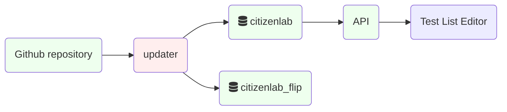

# Backend Analysis

**NOTE** This should not be confused with the analysis stage of the OONI data processing pipeline!

Miscellaneous scripts, services and tools. It contains ancillary
components that are not updated often and might not justify a dedicated
Debian package for each of them.

Deployed using the [analysis package](legacybackend/operations/#analysis-package)&thinsp;📦

<https://github.com/ooni/backend/blob/0ec9fba0eb9c4c440dcb7456f2aab529561104ae/analysis/>

Data flows from various updaters:

<!--
blockdiag {
 default_shape = roundedbox;
 "ASN repo" -> "ASN updater" -> "asnmeta table" -> API;
 "ASN repo" [shape = ellipse];
 "GeoIP repo" -> "GeoIP downloader" -> "/var/lib/ooniapi" -> API;
 "GeoIP repo" [shape = ellipse];
 "CitizenLab repo" -> "CitizenLab updater" -> "CitizenLab table" -> API;
 "CitizenLab repo" [shape = ellipse];
 "CitizenLab table" [shape = ellipse, href = "@@citizenlab-table"];
 "DNS fingerp. tbl" [shape = ellipse, href = "@@fingerprints_dns-table"];
 "Fastpath" [href = "@@fastpath"];
 "Fingerprints repo" -> "Fingerprints updater" -> "DNS fingerp. tbl" -> Fastpath;
 "Fingerprints repo" -> "Fingerprints updater" -> "HTTP fingerp. tbl" -> Fastpath;
 "Fingerprints repo" [shape = ellipse];
 "HTTP fingerp. tbl" [shape = ellipse, href = "@@fingerprints_http-table"];
 "asnmeta table" [shape = ellipse, href = "@@asnmeta-table"];
 "Fingerprints updater" [color = "#eeeeff"];
 "CitizenLab updater" [color = "#eeeeff"];
 "ASN updater" [color = "#eeeeff"];
 "GeoIP downloader" [color = "#eeeeff"];
 "API" [color = "#eeeeff", href = "@@api"];
 "Fastpath" [color = "#eeeeff", href = "@@fastpath"];
}
-->

Ellipses represent data; rectangles represent processes. Purple
components belong to the backend. Click on the image and then click on
each shape to see related documentation.

See the following subchapters for details:

## CitizenLab test list updater

This component fetches the test lists from
[CitizenLab Test List](#citizenlab-test-list)&thinsp;💡 and populates the
[citizenlab table](#citizenlab-table)&thinsp;⛁ and
[citizenlab_flip table](#citizenlab_flip-table)&thinsp;⛁.

The git repository <https://github.com/citizenlab/test-lists.git> is
cloned as an unauthenticated user.

Database writes are performed as the `citizenlab` user.

The tables have few constraints on the database side: most of the
validation is done in the script and it is meant to be strict. The
updater overwrites [citizenlab_flip table](#citizenlab_flip-table)&thinsp;⛁ and
then swaps it with [citizenlab table](#citizenlab-table)&thinsp;⛁ atomically. In
case of failure during git cloning, verification and table overwrite the
final swap does not happen, leaving the `citizenlab` table unaltered.

It is deployed using the [analysis package](legacybackend/operations/#analysis-package)&thinsp;📦 and started
by the [ooni-update-citizenlab](#ooni-update-citizenlab)&thinsp;⏲ Systemd timer.

Logs are generated as the `analysis.citizenlab_test_lists_updater` unit.

Also it generates the following metrics with the
`citizenlab_test_lists_updater` prefix:

| Metric name                | Type  | Description     |
| -------------------------- | ----- | --------------- |
| `fetch_citizen_lab_lists`  | timer | Fetch duration  |
| `update_citizenlab_table`  | timer | Update duration |
| `citizenlab_test_list_len` | gauge | Table size      |

The updater lives in one file:
<https://github.com/ooni/backend/blob/0ec9fba0eb9c4c440dcb7456f2aab529561104ae/analysis/analysis/citizenlab_test_lists_updater.py>

To run the updater manually during development:

    PYTHONPATH=analysis ./run_analysis --update-citizenlab --dry-run --stdout

## Fingerprint updater

This component fetches measurement fingerprints as CSV files from
<https://github.com/ooni/blocking-fingerprints> and populates
[fingerprints_dns table](#fingerprints_dns-table)&thinsp;⛁,
[fingerprints_dns_tmp table](#fingerprints_dns_tmp-table)&thinsp;⛁,
[fingerprints_http table](#fingerprints_http-table)&thinsp;⛁ and
[fingerprints_http_tmp table](#fingerprints_http_tmp-table)&thinsp;⛁.

The tables without `_tmp` are used by the [Fastpath](#fastpath)&thinsp;⚙.

The CSV files are fetched directly without git-cloning.

Database writes are performed as the `api` user, configured in
<https://github.com/ooni/backend/blob/0ec9fba0eb9c4c440dcb7456f2aab529561104ae/analysis/analysis/analysis.py#L64>

The tables have no constraints on the database side and basic validation
is performed by the script:
<https://github.com/ooni/backend/blob/0ec9fba0eb9c4c440dcb7456f2aab529561104ae/analysis/analysis/fingerprints_updater.py#L91>

The updater overwrites the tables ending with `_tmp` and then swaps them
with the \"real\" tables atomically. In case of failure the final swap
does not happen, leaving the \"real\" tables unaltered.

It is deployed using the [analysis package](legacybackend/operations/#analysis-package)&thinsp;📦 and started
by the [ooni-update-citizenlab](#ooni-update-citizenlab)&thinsp;⏲ Systemd timer.

Logs are generated as the `analysis.fingerprints_updater` unit.

Also it generates the following metrics with the `fingerprints_updater`
prefix:

| Metric name                    | Type  | Description        |
| ------------------------------ | ----- | ------------------ |
| `fetch_csv`                    | timer | CSV fetch duration |
| `fingerprints_update_progress` | gauge | Update progress    |
| `fingerprints_dns_tmp_len`     | gauge | DNS table size     |
| `fingerprints_http_tmp_len`    | gauge | HTTP table size    |

See the [Fingerprint updater dashboard](#fingerprint-updater-dashboard)&thinsp;📊 on Grafana.

The updater lives primarily in
<https://github.com/ooni/backend/blob/0ec9fba0eb9c4c440dcb7456f2aab529561104ae/analysis/analysis/fingerprints_updater.py>
and it's called by the `analysis.py` script

To run the updater manually during development:

    PYTHONPATH=analysis ./run_analysis --update-citizenlab --dry-run --stdout

## ASN metadata updater

This component fetches ASN metadata from
<https://archive.org/download/ip2country-as> (generated via:
<https://github.com/ooni/historical-geoip>)

It populates the [asnmeta table](#asnmeta-table)&thinsp;⛁ and
[asnmeta_tmp table](#asnmeta_tmp-table)&thinsp;⛁.

[asnmeta table](#tbl:asnmeta) is used by the private [API](#api)&thinsp;⚙,
see:
<https://github.com/ooni/backend/blob/0ec9fba0eb9c4c440dcb7456f2aab529561104ae/api/ooniapi/private.py#L923>
and <https://api.ooni.io/apidocs/#/default/get_api___asnmeta>

Database writes are performed as the `api` user, configured in
<https://github.com/ooni/backend/blob/0ec9fba0eb9c4c440dcb7456f2aab529561104ae/analysis/analysis/analysis.py#L64>

The table has no constraints on the database side and basic validation
is performed by the script:
<https://github.com/ooni/backend/blob/0ec9fba0eb9c4c440dcb7456f2aab529561104ae/analysis/analysis/asnmeta_updater.py#L95>

Logs are generated as the `analysis.asnmeta_updater` unit.

Also it generates the following metrics with the `asnmeta_updater`
prefix:

| Metric name               | Type  | Description         |
| ------------------------- | ----- | ------------------- |
| `fetch_data`              | timer | Data fetch duration |
| `asnmeta_update_progress` | gauge | Update progress     |
| `asnmeta_tmp_len`         | gauge | table size          |

See the [ASN metadata updater dashboard](#asn-metadata-updater-dashboard)&thinsp;📊 on
Grafana.

To run the updater manually during development:

    PYTHONPATH=analysis ./run_analysis --update-asnmeta --stdout

## GeoIP downloader

Fetches GeoIP databases, installed by the [ooni-api](#api)&thinsp;⚙. Started
by the [ooni-download-geoip timer](#ooni-download-geoip-timer)&thinsp;⏲ on
[backend-fsn.ooni.org](#backend-fsn.ooni.org)&thinsp;🖥, see.

Lives at
<https://github.com/ooni/backend/blob/0ec9fba0eb9c4c440dcb7456f2aab529561104ae/>
<https://github.com/ooni/backend/blob/0ec9fba0eb9c4c440dcb7456f2aab529561104ae/api/debian/ooni_download_geoip.py>

Updates `asn.mmdb` and `cc.mmdb` in `/var/lib/ooniapi/`

Can be monitored with the [GeoIP MMDB database dashboard](#geoip-mmdb-database-dashboard)&thinsp;📊
and by running:

    sudo journalctl --identifier ooni_download_geoip

## Database backup tool

The backup tool is a service that regularly backs up
[ClickHouse](#clickhouse)&thinsp;⚙ tables to S3. It also exports tables in
`CSV.zstd` format for public consumption.

Contrarily to similar tools, it is designed to:

- extract data in chunks and upload it without creating temporary
  files

- without requiring transaction support in the database (not available
  in ClickHouse)

- without requiring transactional filesystems or interrupting the
  database workload

It is configured by [Ansible](#ansible)&thinsp;🔧 using the
`/etc/ooni/db-backup.conf` file. Runs as a SystemD service, see
[ooni-db-backup timer](#ooni-db-backup-timer)&thinsp;⏲

It compresses data using <https://facebook.github.io/zstd/> during the
upload.

The tool chunks tables as needed and add sleeps as needed to prevent a
query backlog impacting the database performance.

Logs are generated as the `ooni-db-backup` unit.

Also it generates the following metrics with the `db-backup` prefix:

| Metric name                      | Type  | Description          |
| -------------------------------- | ----- | -------------------- |
| `upload_to_s3`                   | timer | Data upload duration |
| `run_export`                     | timer | Data export duration |
| `table_{tblname}_backup_time_ms` | timer | Table backup time    |

See the [Database backup dashboard](#database-backup-dashboard)&thinsp;📊 on Grafana and
[Metrics list](#metrics-list)&thinsp;💡 for application metrics.

Monitor with:

    sudo journalctl -f --identifier ooni-db-backup

Future improvements:

- [private/public backups](https://github.com/ooni/backend/issues/766)

- [safer table backup workflow](https://github.com/ooni/backend/issues/767)

- [database schema backup](https://github.com/ooni/backend/issues/765).
  For extracting the schema see [Database schema check](#database-schema-check)&thinsp;💡

## Ancillary modules

`analysis/analysis/analysis.py` is the main analysis script and acts as
a wrapper to other components.

`analysis/analysis/metrics.py` is a tiny wrapper for the Statsd Python
library.

## Social media blocking event detector

Blocking event detector currently under development. Documented in
<https://docs.google.com/document/d/1WQ6_ybnPbO_W6Tq-xKuHQslG1dSPr4jUbZ3jQLaMqdw/edit>

Deployed by the [detector package](#detector-package)&thinsp;📦.

See [Monitor blocking event detections notebook](#monitor-blocking-event-detections-notebook)&thinsp;📔
[Event detector dashboard](#dash:detector) [Detector timer](#detector-timer)&thinsp;⏲
