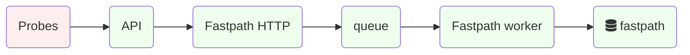

# Fastpath

The fastpath is a data processing pipeline designed to process incoming
measurements in real time.

It also supports processing old measurements by fetching them from the
[S3 data bucket](#s3-data-bucket)&thinsp;💡.

- Generate scoring metadata and flag them as `confirmed`, `anomaly` as
  needed.

- Detect invalid measurements (e.g. from the future) and flag them as
  `failed`.

- Extract metadata from measurements e.g. `engine_version`

- Write scoring and metadata to the [fastpath table](#fastpath-table)&thinsp;⛁

- Extract OpenVPN observations into [obs_openvpn table](#obs_openvpn-table)&thinsp;⛁

Data flow diagram:

<!--
blockdiag {
 default_shape = roundedbox;
 "S3 jsonl" [shape = ellipse];
 "S3 postcans" [shape = ellipse];
 "disk queue" [shape = ellipse];
 "jsonl table" [shape = ellipse];
 Probes [numbered = 1];
 API [numbered = 2, href = "@@api"];
 uploader [numbered = 3, href = "@@haproxy"];
 Probes -> API -> "disk queue" -> uploader -> "S3 jsonl";
 uploader -> "S3 postcans";
 uploader -> "jsonl table";

 Probes [color = "#ffeeee"];
}
-->

Ellipses represent data; rectangles represent processes. Click on the
image and then click on each shape to see related documentation.

The fastpath has been designed around a set of goals:

- Resiliency: the processing pipeline is lenient towards measurements
  with missing or incorrect fields to mitigate the impact of known and
  unknown bugs in the incoming measurements. Also it is designed to
  minimize the risk of crashing out, blocking or deadlocking.
  Ancillary data sources e.g.
  [Fingerprint updater](#fingerprint-updater)&thinsp;⚙ have failure modes that do not
  block the fastpath.

- Horizontal scalability: Measurement processing is stateless and
  supports lockless multiprocessing. Measurement collection, spooling
  and processing can scale horizontally on multiple hosts.

- Security: measurements are received from a public API and treated as
  untrusted input. All backend components are built on a secure SBOM
  and are sandboxed using minimum privileges.

- Maintainability: all data flows in one direction from the API
  through a simple queue system to the database. The only information
  flowing in the opposite direction is backpressure to prevent
  stalling or unbounded RAM usage when the CPUs are saturated. The
  code style favors simplicity and readability over speed and feature
  richness.

- Support unit, functional, end-to-end integration testing, CI/CD.

### Core logic

Python module:
<https://github.com/ooni/backend/blob/0ec9fba0eb9c4c440dcb7456f2aab529561104ae/fastpath/fastpath/core.py>

Implement the main logic:

- Parse CLI options and configuration files and manage local
  directories.

- Fetch and prepare HTTP and DNS fingerprints from the
  [fingerprints_dns table](#fingerprints_dns-table)&thinsp;⛁ and
  [fingerprints_http table](#fingerprints_http-table)&thinsp;⛁. See
  [Fingerprint updater](#fingerprint-updater)&thinsp;⚙.

- Spawn a local HTTP server to receive fresh measurements from the
  API. See `localhttpfeeder.py`

- Spawn and manage a worker pool to scale out horizontally on
  available CPU cores.

- Alternatively, feed measurements from the [S3 data bucket](#s3-data-bucket)&thinsp;💡.

- Process incoming measurements, see the `process_measurement`
  function.

- Score each measurement individually, see the `score_measurement`
  function. The scoring functions e.g. `score_measurement_telegram`
  are meant to focus only on test-specific data, be stateless and
  unit-testable in isolation.

- Generate anomaly, confirmed and failure flag consistently with
  [Explorer](#explorer)&thinsp;🖱 and the batch pipeline used before.

- Extract metadata and upsert each measurement into
  [fastpath table](#fastpath-table)&thinsp;⛁ in `clickhouse_upsert_summary`

The fastpath also supports buffering writes into large batches to avoid
single-record insert queries in ClickHouse. This provides a 25x speedup
when [Reprocessing measurements](#reprocessing-measurements)&thinsp;📒 from
[S3 data bucket](#s3-data-bucket)&thinsp;💡.

This is not meant to be used for real-time measurement scoring as it
would create risk of losing multiple records in case of failed query,
crash, etc and also increase latency.

> **note**
> Batching writes can also be implemented in ClickHouse using
> [Buffer Table Engine](https://clickhouse.com/docs/en/engines/table-engines/special/buffer)
> or
> [async insert](https://clickhouse.com/docs/en/optimize/asynchronous-inserts)

### Database module

Python module:
<https://github.com/ooni/backend/blob/0ec9fba0eb9c4c440dcb7456f2aab529561104ae/fastpath/fastpath/db.py>

Implements all the database-related functions. The rest of the codebase
is database-agnostic.

> **note**
> Upserts are based on the MergeTree table engine, see
> [Overall design](#overall-design)&thinsp;💡.

### S3 Feeder

Python module:
<https://github.com/ooni/backend/blob/0ec9fba0eb9c4c440dcb7456f2aab529561104ae/fastpath/fastpath/s3feeder.py>

Implements the fetching of measurements from
[S3 data bucket](#s3-data-bucket)&thinsp;💡. The rest of the codebase is agnostic of S3.

It supports new and legacy cans and JSON and YAML formats.

See [Feed fastpath from JSONL](#feed-fastpath-from-jsonl)&thinsp;🐞

### YAML normalization

Python module:
<https://github.com/ooni/backend/blob/0ec9fba0eb9c4c440dcb7456f2aab529561104ae/fastpath/fastpath/normalize.py>

Transforms legacy measurement format in YAML into JSON. YAML form is
legacy and not used for new measurements.
