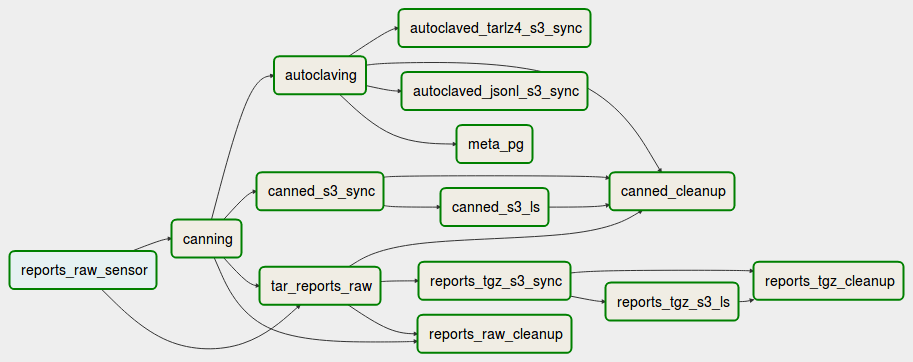

This document describes, how to remove reports from historical data with minimal resources waste and minimal damage to the
on-going data processing.

This document is valid as of February 2019, when the [Airflow data processing graph](./pipeline-16.10.md#data-flow) looked like following one:



## "Modern" buckets

Here is the checklist of places to clean up the report (for buckets >= 2018):

- `s3://ooni-data-private/archives-raw/yaml/YYYY-MM-DD.tar.gz`
- `s3://ooni-data-private/archives-raw/yaml/YYYY-MM-DD.index.json.gz`
- `datacollector.infra.ooni.io:/data/ooni/private/reports-tgz/YYYY-MM-DD.index.json.gz`
- `s3://ooni-data-private/canned/YYYY-MM-DD/test_name.42.tar.lz4`
- `s3://ooni-data-private/canned/YYYY-MM-DD/index.json.gz`
- `datacollector.infra.ooni.io:/data/ooni/private/canned/YYYY-MM-DD.index.json.gz`
- `s3://ooni-data/autoclaved/jsonl.tar.lz4/YYYY-MM-DD/test_name.42.tar.lz4`
- `s3://ooni-data/autoclaved/jsonl.tar.lz4/YYYY-MM-DD/index.json.gz`
- `datacollector.infra.ooni.io:/data/ooni/public/autoclaved/YYYY-MM-DD/test_name.42.tar.lz4`
- `datacollector.infra.ooni.io:/data/ooni/public/autoclaved/YYYY-MM-DD/index.json.gz`
- `s3://ooni-data/autoclaved/jsonl/YYYY-MM-DD/yyyymmddThhmmssZ-ZZ-AS0-test_name-...-probe.json`

## "Legacy" buckets

Older reports may also(!) be stored in legacy folders and archives under following roots
in addition to aforementioned places:
- `s3://ooni-data-private/`
- `s3://ooni-data/sanitised/`

Dealing with legacy data is out of the scope of this document.

## Archive re-compression

Both `archives-raw/yaml` and `canned` archives have to be re-compressed deleting affected report files.

To keep `index.json.gz` file in-sync with actual archives, `delete_canned_report.py`
script has to be used. The script is conceptually a wrapper around
`gzip -d <in/test_name.42.tar.gz | tar --delete ... | gzip >out/test_name.42.tar.gz`
that also maintains `index.json.gz`.

Let's assume that:
- `affected.textname` lists all report files to delete from archives
- `affected.bucket_date` lists all affected buckets
- all affected `autoclaved` files were alread removed both from S3 and from datacollector.infra.ooni.io filesystem

First, `reports-tgz` (huge, beware of disk usage!) and `canned` (smaller) archives have to be fetched from private S3 bucket:

```
user@datacollector:~$ sudo docker pull openobservatory/pipeline-shovel:latest
user@datacollector:~$ sudo mkdir /data/ooni/private/fix-{tgz,can} && sudo chown 1000:1000 /data/ooni/private/fix-{tgz,can}
user@datacollector:~$ sudo docker run --rm -ti --env-file=/srv/etc/af-worker/s3_ooni_datacollector.env -u 1000:1000 -v /data/ooni/private:/p:rw -v $PWD:/opt:ro openobservatory/pipeline-shovel:latest
$ aws s3 sync s3://ooni-data-private/archives-raw/yaml/ /p/reports-tgz/  --exclude '*' $(sed 's,.*,--include &.tar.gz,' /opt/affected.bucket_date)
$ for b in $(cat /opt/affected.bucket_date); do for f in $(delete_canned_report.py --files-from /opt/affected.textname --canned /p/canned --bucket "$b" --list); do test ! -f /p/canned/"$f" && aws s3 cp s3://ooni-data-private/canned/"$f" /p/canned/"$f"; done; done
```

Second, the archives have to be cleaned up:

```
user@datacollector:~$ sudo docker run --rm -ti -u 1000:1000 -v /data/ooni/private:/p:rw -v $PWD:/opt:ro openobservatory/pipeline-shovel:latest
$ for b in $(cat /opt/affected.bucket_date); do delete_canned_report.py --files-from /opt/affected.textname --reports-tgz /p/reports-tgz --bucket "$b" --dst /p/fix-tgz; done
$ for b in $(cat /opt/affected.bucket_date); do delete_canned_report.py --files-from /opt/affected.textname --canned /p/canned --bucket "$b" --dst /p/fix-can; done; date
```

Third, `autoclaved` files deleted earlier have to be re-created from `canned` files:

```
user@datacollector:~$ sudo docker run --rm -ti -u 1000:1000 -v /data/ooni/private:/p:ro -v /data/ooni/public:/pub:rw -v $PWD:/opt:ro openobservatory/pipeline-shovel:latest
$ for b in $(cat /opt/affected.bucket_date); do chmod u+w "/pub/autoclaved/${b}" && autoclaving.py --canned-root /p/fix-can --bridge-db /p/bridge_db/bridge_db.json --autoclaved-root /pub/autoclaved --missing --start ${b}T00:00:00 --end $(date -d "$b + 1 day" --rfc-3339=date)T00:00:00; done
```

Fourth, changed `autoclaved` files in the affected buckets have to be re-ingested into MetaDB. That's done under GNU `make` control as Airflow scheduler is not happy about hundreds of DAGs being active. Also, exit-code of the TaskInstances should be inspected to verify that all the buckets are processed correctly:

```
user@datacollector:~$ tmux
user@datacollector:~$ ./pipeline-reprocess reprocess
user@datacollector:~$ ./pipeline-reprocess rc
```

Fifth, the `autoclaved` files should be published to S3 now, API already tries to fetch them as metadata in now updated in the MetaDB:

```
user@datacollector:~$ sudo docker run --rm -ti --env-file=/srv/etc/af-worker/s3root.env -u 1000:1000 -v /data/ooni/public:/pub:ro -v $PWD:/opt:ro openobservatory/pipeline-shovel:latest
$ cd /pub/autoclaved
$ for b in $(cat /opt/affected.bucket_date); do aws s3 sync ${b}/ s3://ooni-data/autoclaved/jsonl.tar.lz4/${b}/; done
```

Sixth, archives stored in private S3 bucket are updated:

```
user@datacollector:~$ sudo docker run --rm -ti --env-file=/srv/etc/af-worker/s3_ooni_datacollector.env -u 1000:1000 -v /data/ooni/private:/p:ro -v $PWD:/opt:ro openobservatory/pipeline-shovel:latest
$ cd /p/fix-tgz
$ for f in *; do aws s3 cp ${f} s3://ooni-data-private/archives-raw/yaml/${f}; done
$ cd /p/fix-can
$ for b in *; do aws s3 sync ${b}/ s3://ooni-data-private/canned/${b}/; done
```

At this point `VACUUM FULL` should be run on MetaDB tables and
all the previous MetaDB snapshots and WALs should be probably deleted from
[public MetaDB archive](https://github.com/ooni/sysadmin/issues/272)
depending on reason for report deletion.

Last, file trees on `datacollector` should be updated and stale cashes should be purged:

```
user@datacollector:~$ cd /data/ooni/private/reports-tgz/
user@datacollector:~$ sudo rm /data/ooni/private/fix-tgz/*.tar.gz
user@datacollector:~$ sudo mv /data/ooni/private/fix-tgz/*.index.json.gz /data/ooni/private/reports-tgz/
user@datacollector:~$ sudo rm $(sed 's,$,.tar.gz,' ~/affected.bucket_date)

user@datacollector:~$ cd /data/ooni/private/fix-can/
user@datacollector:~$ for b in $(cat ~/affected.bucket_date); do sudo mv $b/index.json.gz /data/ooni/private/canned/$b/index.json.gz; done
user@datacollector:~$ find . -type f | sed 's,^,/data/ooni/private/canned/,' | xargs sudo rm
user@datacollector:~$ sudo find . -type f -delete
user@datacollector:~$ sudo rmdir *

user@datacollector:~$ cd /data/ooni/private/reports-tgz-s3-ls/
user@datacollector:~$ sudo rm $(sed 's,$,.json.gz,' ~/affected.bucket_date)

user@datacollector:~$ cd /data/ooni/private/canned-s3-ls/
user@datacollector:~$ sudo rm $(sed 's,$,.json.gz,' ~/affected.bucket_date)
```

## Logs

It's possible to estimate if the report was ever accessed or not using logs of:
- `api.ooni.io` webserver storing nginx logs
- `s3://ooni-data-logs/` storing logs of `s3://ooni-data/` access
