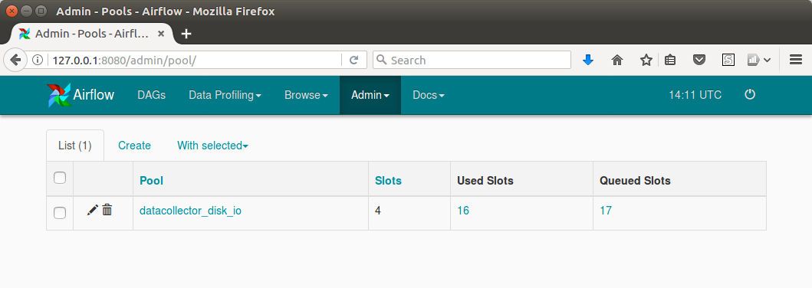

The purpose of this document is to outline goals, non-goals and some decisions regarding new next version of the ooni-pipeline.

Pipeline's goals:
* ease raw data management: the raw data does not perfectly fit one server box, pre-processed data makes database management harder
* preserve compatibility layer in the pipeline itself
* reduce end-to-end latency as current pipeline clock tick is 24 hours

* ease pipeline parallelisation, as it currently does not utilise 100% of 4 core (8 threads) server box


Pipeline's non-goals:
* real-time latency, 30 seconds of end-to-end latency is not our target, 10 minutes is OK

Current pipeline management tool is [luigi](https://luigi.readthedocs.io/en/stable/design_and_limitations.html) and it explicitly mentions limitations we're facing:
- luigi does not manage workers doing the computations, so it can't suggest cheap parallelisation support
- luigi manages it's state in pickle files and does not provide clean way to analyse history of task executions

[Apache airflow](https://airflow.apache.org/) is one of ETL pipeline management solutions that may be used to address aforementioned goals. It can also be used as a poor-man map-reduce
scheduler due to [Pool](http://pythonhosted.org/airflow/concepts.html#pools) support, although every job in the pool uses has same weight, so it's not a
perfect fit for RAM-intensive jobs.

There are several *technological decisions* to be made regarding airflow deployment:
- Airflow relies on SqlAlchemy so it is intended to speak with sqlite3 in development environment and with MySQL or Postgres in production.  We're
  going to use Postgres as we're already using it as a data storage for OONI explorer visualisation, so it's familiar technology.
- Airflow relies on either on `multiprocessing` or on Celery to submit tasks to workers to use several CPUs and/or nodes.  Both executors run a separate
  short-lived subprocess for every task, but there is a good reason to use Celery from the 1st day: it allows to separate executor from scheduler, it matters
  as Airflow 1.7.1.3 has a bug that leads to scheduler being dead-locked and/or live-locked, so restarting scheduler is a valuable addition.
- Celery itself may have different queue management solutions: RabbitMQ and Redis.
  Redis is trivial to manage and debug in contrast with RabbitMQ, but RabbitMQ is more widely-adopted and, moreover, we can quite safely follow the route of
  "restarting from scratch" in case of catastrophic failure. We should store enough metadata in the pipeline tasks to be able to drop persistent RabbitMQ
  queue and Airflow Postgresql database and start from some known point in time.
- Ability to "restart from scratch" without re-processing the data is required due to possible database inconsistencies triggered by airflow bugs (at least
  one XCom-related fatal inconsistency was observed in 1.7.1.3), DAG configuration errors and "hard" restarts of stuck scheduler process.

There are several tasks to be solved while migrating pipeline to Airflow:
- Temporary file storage. We don't need intermediate files like normalised probe reports per se. `luigi` also has no concept of intermediate files, so
  it's basically part of raw data management tasks.
- Incremental explorer database updates. That's quite easy as we can pseudo-shard any table using, for example, date of the measurement or
  incoming timestamp of the measurement.
- Incremental backfill. It may be a bit harder task to do as it partially kills idea of idempotency. Example: we use the date of measurement as a
  pseudo-shard key, some probe was offline for a couple of days, returns back and now we have some back-dated measurements. Moreover, absence-of-measurement is
  also a viable data. **Open question is**: how should we write "backdated" reports when new data comes. Current way is to do a full update and pretend
  that no "history modifications" took place at all.
  Also, some pipeline operations use external dictionaries (like IP → AS mappings).
  These dictionaries may be modified in-place without extension, so it's another source of possible non-idempotency.

There are also tasks that are not related to migrating to Airflow, but are relevant to pipeline re-engineering:

- No future-proof normalisation right now. Publishing normalised data requires three data copies 1) raw data 2) raw data offline backup 3) normalised and
  sanitised data. Given 1 Tb of data it's still cheaper to store the data in S3-like fashion and avoid a) additional effort in data de-duplication b)
  additional effort in incremental data normalisation when *normal* format is changed.
  It may change when we have 10 Tb but given current data growth rate it may be postponed till another pipeline re-engineering takes place.

- Raw data storage. Right now it's OK to store raw data as a compressed blob in the filesystem addressed by some ID. But given the fact that "local" disk is
  limited by ~1Tb we may want to scale it to some S3-like datastore to avoid managing disks. Moreover, we'll have non-local data access as soon as we want
  to scale pipeline processing to another node due to lack of CPU. Moving raw data out of database requires creation of metadata storage to handle indexes
  pointing back to the data. Postgres should be a good fit given current data volume.

- ID generation procedure. We can't use client-generated ID (that is like SMTP's `Message-ID`) for storage as it may be colliding with other
  measurements, so we have to generate Unique Identifier (like IMAP's `UID`).
  UID may be issued by metadata storage, but it may be slow due to centralized nature of the counter. UID may be generated using content itself. For example,
  `SHA256(Unixtime || Client-ID || Canonical-Message-Representation)`.
  The key is significantly larger in this case, so metadata store will be a bit larger.

- Raw data compression. It's also possible to achieve a bit better data compression using different algorithms for hot and cold storage, but given current data volume it does not provide significant gain.

- Sanitized data storage. It should be compressed and both batch-friendly and single-measurement-friendly to serve as a datastore for interactive
  measurement webpage of OONI explorer. Storing each measurement as a separate S3 object may lower compression ratio and increase batch processing timings due to
  latency penalty to fetch each single measurement.  Storing whole 100 MBytes-sized report as a single compressed blob induces significant network
  transfer & CPU penalty on OONI explorer (~200 ms to transfer 25 Mbytes over 1Gbit/s link + ~60 ms to decompress that amount of data). So the data should be
  split/merged into separate chunks for long-term storage. These chunks should be either distinct compression blocks within a stream or separate files.
  The size of the chunk should be determined based on the observable latency throughput of Greenhost network to fetch the blobs via S3-like API and via
  read-only NFS.


Data dependencies
=================

This graph show some of data dependencies, it's incomplete, it's not strict DAG (look at blockpages to see the loop), but it describes the reasoning behind
processing being split into transformation (per-measurement) and aggregation:


Infra
=====

Datastore is currently filesystem-based, but all code is written in streaming way to make migration to objectstore easier.

Airflow is "smart cron" manager, airflow is deployed with docker. Exact recipe is based on [puckel/docker-airflow](https://github.com/puckel/docker-airflow/) and some crutches overlayed on top of that image.

Data processing happens in separate container (*ooni/shovel*) to avoid bringing unstable dependencies to airflow container as mixing unstable software is scary.


Data flow
=========

There are three major "daily" steps: 1. *canning*, 2. *autoclaving*, 3. *centrifugation*.

**Canning** converts reports-raw to tar.lz4 files in following way:

```
  canning-1.py | tar c 2000-13-42/foo.yaml 2000-13-42/bar.json | canning-2.py | lz4 -5 | canning-3.py
```

canning-1: group reports by `test_name`, slice tham into ~64 Mbytes groups of uncompressed data, send them to `tar`
canning-2: read tar file, verify sizes of reports, calculate sha1 and crc32 of each report, calculate size of tar file, pipe it to `lz4`
canning-3: read lz4 from the pipe, calculate it's size, sha1 and crc32, dump lz4 & all the checksums to disk

All the sizes are recorded to be checked to avoid various sort of unexpected file truncations.

**Autoclaving** replaces normalization and sanitization, it converts tar.lz4 files in 1:1 way.
lz4 compression is a bit tricky at this stage: lz4 frames are independent,
report offsets within the block are recorded in the separate index file, so the
resulting file is both streamable (with ability to skip tar records without
decoding), seekable (single lz4 frame is read to get a single report — that's
~56kb of compressed data) and readable with ordinary `tar -I lz4 --extract` for
whoever wanting to parse sanitized measurements.

Indexes for the reports are stored as well, they include block offsets, sizes, and offsets within block required to seek() to exact measurement and to read the file in streaming way without parsing tarfile stream.

**Centrifugation** is done to enrich the data.
It reads data sanitized by autoclaving, extract the aggregatable essence and stores metadata into postgresql db for further processing.
More on this step later.


Highlights
==========

*Daily?* — daily bucket gives better compression ratio and more "sane" data chunks for HDD-based storage for later re-processing compared to individual compression of every report. Autoclaving and centrifugation may be done on incoming raw data more often, but end-of-the day wrap-up sounds reasonable.

*tar?* — Each tiny report costs several IO operations. That produces measurable slowdown if the data is HDD-stored, so we need some "streaming" way to read and write reports.

*${test_name}.42.tar.lz4* — re-centrifugation is likely triggered by some new code that can extract some new value from existing data and it usually depends on test type.

*lz4* — `lz4 -5` gives ~21% compression ratio for canned data, `gzip -9` is 19%, but lz4 has blazingly fast decompressor and it's not even observable at [pyflame](https://github.com/uber/pyflame) flamechart while reading json from lz4 file.

*LZ4 frames* — Using a block per measurements costs ~10…15% of datastore (~21% compression ratio becomes [~24%](https://gist.github.com/darkk/5736767b8bb1adbf4f5baec24d839d8e)), and having several measurements per block costs single memcpy() of uncompressed data while building string slice.

*SHA1* — SHA1 is **not** used as a secure hash function, it's just a [speedy checksum](https://github.com/TheTorProject/ooni-pipeline/issues/40#issuecomment-275941676) that may be used to detect possible duplicates and for data scrubbing as LZ4 [does not currently implement](https://github.com/lz4/lz4/blob/v1.7.4.2/lib/lz4frame.c#L873) checksums for **compressed** data (aka *Block checksum*). OONI report storage is not tamper-evident as well.

Centrifugation
==============

There are several possible actions to do with each autoclaved file during *centrifugation*.

1. *ingest* -- the file was never seen and is processed for the first time
2. *reingest* -- the autoclaved file was changed (including LZ4 framing) and all corresponding records should be updated
3. *reprocess* -- the file was already processed, but some new table has to be populated

Ingestion is normal process of new data entering the system.

Reingestion is usually caused by PII cleanup or other updates to *autoclaving*
step. Reingestion is usually trigged by changed `file_sha1` of autoclaved file.

Reprocessing is triggered by `code_ver`. Every autoclaved file has
`autoclaved.code_ver` mark in the metadata postgres DB and whole step has
`centrifugation.CODE_VER` as well set in `centrifugation.py`.
If `code_ver` and `CODE_VER` match, the file is not processed at all, it's not
even read. If `code_ver` does not match, then the file is read, but it depends
on `code_ver` column and `min_compat_code_ver` attribute if corresponding tables
are overwritten.

Gotchas
=======

`liblz4-tool=0.0~r122-2` from debian:jessie can't handle *Content Size*
in [LZ4 frame](https://github.com/lz4/lz4/wiki/lz4_Frame_format.md) and fails
with `Error 64 : Does not support stream size` while decoding. This flag eases
memory allocation for decompressor, so autoclaving enables it while calling
python-lz4 code.  `liblz4-tool=0.0~r131*` from ubuntu:16.04 or debian:stretch
handles alike stream without issues.

Airflow-1.7.1.3 does **NOT** properly manage pools when re-filling process is
started via UI using following steps:
1. remove *Tasks Instances* that should be re-executed
2. Set state of corresponding *DAG Runs* to *running*

Better way is to enter airflow container and requst task runs via CLI:
```
root@host# docker exec  -ti dockerairflow_webserver_1 /bin/bash
airflow@ws$ yyyymmdd_seq() { local start="$1"; local end="$2"; while [ "$start" != "$end" ]; do echo "$start"; start=$(date -d "${start} + 1 day" +%Y-%m-%d); done; echo "$end"; }
airflow@ws$ for day in $(yyyymmdd_seq YYYY-MM-DD yyyy-mm-dd | tac); do airflow run --force --pool $pool --ship_dag $dag_id $task_id $day; done
```

References
==========

Using postgres *[Versioning](https://github.com/depesz/Versioning/)* by [Hubert "depesz" Lubaczewski](https://www.depesz.com/2010/08/22/versioning/).
The easiest of the [alternatives](https://wiki.postgresql.org/wiki/Change_management_tools_and_techniques),
[inspiring successors](https://docs.google.com/presentation/d/1TV0bExFwVy-_d6C7A8Z2JL9Z9tvtkuZv3D58fkC3GWQ/edit).
