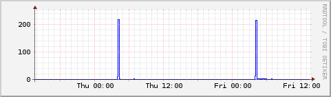
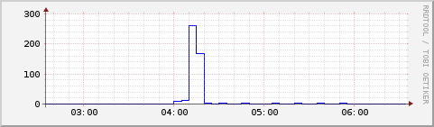
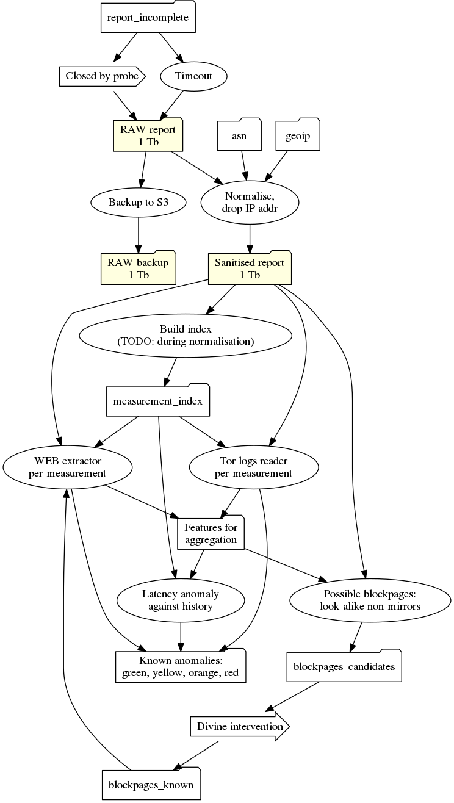

The purpose of this document is to outline goals, non-goals and some decisions regarding new next version of the ooni-pipeline.

Goals:
* ease raw data management: the raw data does not perfectly fit one server box, pre-processed data makes database management harder
* preserve compatibility layer in the pipeline itself
* reduce end-to-end latency as current pipeline clock tick is 24 hours

* ease pipeline parallelisation, as it currently does not utilise 100% of 4 core (8 threads) server box

Non-goals:
* real-time latency, 30 seconds of end-to-end latency is not our target, 10 minutes is OK

Current pipeline management tool is [luigi](https://luigi.readthedocs.io/en/stable/design_and_limitations.html) and it explicitly mentions limitations we're facing:
- luigi does not manage workers doing the computations, so it can't suggest cheap parallelisation support
- luigi manages it's state in pickle files and does not provide clean way to analyse history of task executions

Apache airflow is one of ETL pipeline management solutions that may be used to
address aforementioned goals. It can also be used as a poor-man map-reduce
scheduler due to [Pool](http://pythonhosted.org/airflow/concepts.html#pools)
support, although every job in the pool uses has same weight, so it's not a
perfect fit for RAM-intensive jobs.

There are several technological decisions to be made regarding airflow deployment:
- Airflow relies on SqlAlchemy so it is intended to speak with sqlite3 in
  development environment and with MySQL or Postgres in production.  We're
  going to use Postgres as we're already using it as a data storage for OONI
  explorer visualisation, so it's familiar technology.
- Airflow relies on either on `multiprocessing` or on Celery to submit tasks to
  workers to use several CPUs and/or nodes.  Both executors run a separate
  short-lived subprocess for every task, but there is a good reason to use Celery
  from the 1st day: it allows to separate executor from scheduler, it matters
  as Airflow 1.7.1.3 has a bug that leads to scheduler being dead-locked and/or
  live-locked, so restarting scheduler is a valuable addition.
- Celery itself may have different queue management solutions: RabbitMQ and Redis.
  Redis is trivial to manage and debug in contrast with RabbitMQ, but RabbitMQ
  is more widely-adopted and, moreover, we can quite safely follow the route of
  "restarting from scratch" in case of catastrophic failure. We should store
  enough metadata in the pipeline tasks to be able to drop persistent RabbitMQ
  queue and Airflow Postgresql database and start from some known point in time.
- Ability to "restart from scratch" without re-processing the data is required
  due to possible database inconsistencies triggered by airflow bugs (at least
  one XCom-related fatal inconsistency was observed in 1.7.1.3), DAG
  configuration errors and "hard" restarts of stuck scheduler process.

There are several tasks to be solved while migrating pipeline to Airflow:
- Temporary file storage. We don't need intermediate files like normalised
  probe reports per se. `luigi` also has no concept of intermediate files, so
  it's basically part of raw data management tasks.
- Incremental explorer database updates. That's quite easy as we can
  pseudo-shard any table using, for example, date of the measurement or
  incoming timestamp of the measurement.
- Incremental backfill. It may be a bit harder task to do as it partially kills
  idea of idempotency. Example: we use the date of measurement as a
  pseudo-shard key, some probe was offline for a couple of days, returns back and
  now we have some back-dated measurements. Moreover, absence-of-measurement is
  also a viable data. **Open question is**: how should we write "backdated"
  reports when new data comes. Current way is to do a full update and pretend
  that no "history modifications" took place at all.
  Also, some pipeline operations use external dictionaries (like IP → AS mappings).
  These dictionaries may be modified in-place without extension, so it's another source of possible non-idempotency.

There are also tasks that are not related to migrating to Airflow, but are relevant to pipeline re-engineering:

- No future-proof normalisation right now. Publishing normalised data requires
  three data copies 1) raw data 2) raw data offline backup 3) normalised and
  sanitised data. Given 1 Tb of data it's still cheaper to store the data in
  S3-like fashion and avoid a) additional effort in data de-duplication b)
  additional effort in incremental data normalisation when *normal* format is
  changed.
  It may change when we have 10 Tb but given current data growth
  rate it may be postponed till another pipeline re-engineering takes place.

- Raw data storage. Right now it's OK to store raw data as a compressed blob in
  the filesystem addressed by some ID. But given the fact that "local" disk is
  limited by ~1Tb we may want to scale it to some S3-like datastore to avoid
  managing disks. Moreover, we'll have non-local data access as soon as we want
  to scale pipeline processing to another node due to lack of CPU. Moving raw
  data out of database requires creation of metadata storage to handle indexes
  pointing back to the data. Postgres should be a good fit given current data
  volume.

- ID generation procedure. We can't use client-generated ID (that is like
  SMTP's `Message-ID`) for storage as it may be colliding with other
  measurements, so we have to generate Unique Identifier (like IMAP's `UID`).
  UID may be issued by metadata storage, but it may be slow due to centralized
  nature of the counter. UID may be generated using content itself. For example,
  `SHA256(Unixtime || Client-ID || Canonical-Message-Representation)`.
  The key is significantly larger in this case, so metadata store will be a bit larger.

- Raw data compression. It's also possible to achieve a bit better data compression using different
  algorithms for hot and cold storage, but given current data volume it does
  not provide significant gain.

- Sanitized data storage. It should be compressed and both batch-friendly and
  single-measurement-friendly to serve as a datastore for interactive
  measurement webpage of OONI explorer. Storing each measurement as a separate S3
  object may lower compression ratio and increase batch processing timings due to
  latency penalty to fetch each single measurement.  Storing whole 100
  MBytes-sized report as a single compressed blob induces significant network
  transfer & CPU penalty on OONI explorer (~200 ms to transfer 25 Mbytes over
  1Gbit/s link + ~60 ms to decompress that amount of data). So the data should be
  split/merged into separate chunks for long-term storage. These chunks should be
  either distinct compression blocks within a stream or separate files.
  The size of the chunk should be determined based on the observable latency /
  throughput of Greenhost network to fetch the blobs via S3-like API and via
  read-only NFS.

### Data dependencies

This graph show some of data dependencies, it's incomplete, it's not strict DAG
(look at blockpages to see the loop), but it describes the reasoning behind
processing being split into transformation (per-measurement) and aggregation:

